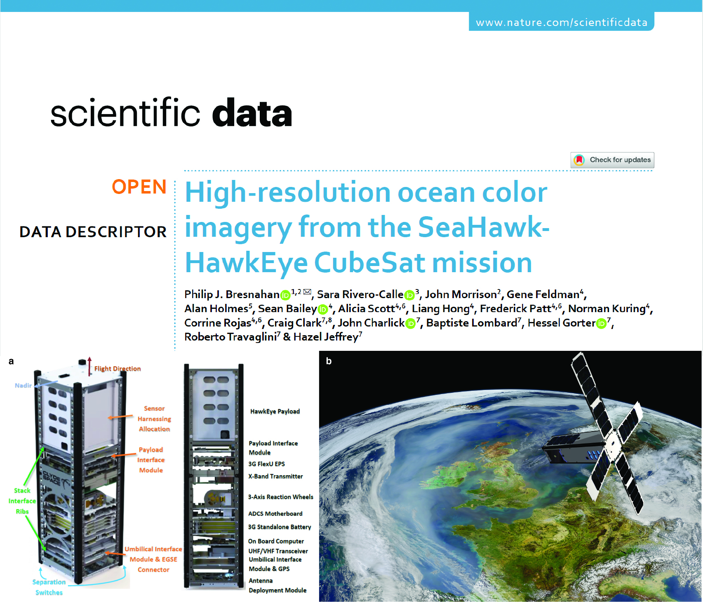

In 2022, we were awarded a multi-institution, academic/government/industry collaborative grant from the Gordon & Betty Moore Foundation to use the satellite ocean color imagery from the SeaHawk-HawkEye project for high-resolution coastal water quality analyses. 

For more information, check out the (open-access) paper in Nature's Scientific Data here: [High-resolution ocean color imagery from the SeaHawk-HawkEye CubeSat mission](https://www.nature.com/articles/s41597-024-04076-4). 

For more information regarding usage of HawkEye imagery in an analysis of coastal dynamics, please also see [Torkelson, M.*, Bresnahan, P.J., Rivero-Calle, S., Masud-Ul-Alam, M., Brewin, R.J.W., & Wells, D. (2026). Integrating In Situ Measurements and Satellite Imagery for Coastal Physical and Biological Analysis in the Cape Fear Coastal Region. Remote Sensing, 18(10), 1524. doi.org/10.3390/rs18101524](https://doi.org/10.3390/rs18101524).

