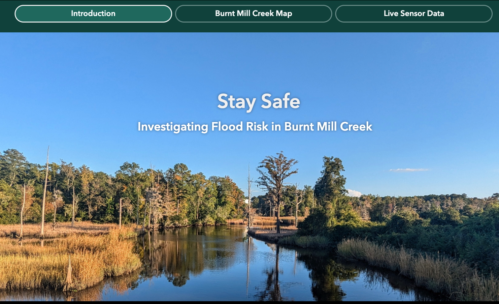

### Improving Coastal Literacy and Resilience in Classrooms and Communities in the City of Wilmington

Improved flood preparation and resilience require a community-engaged approach to understanding and meeting local needs. Researchers, educators, and community leaders are collaborating to build a flood alerting and education network in Wilmington, NC.

Wilmington, NC, USA, experiences one of the highest rates of relative sea-level rise in the world, has one of the shortest hurricane return periods, and local socioeconomic disparities further increase flood risk for frontline communities, creating a rapidly changing and difficult-to-manage scenario. This NC Sea Grant and WRRI-funded collaboration among academics, government employees, community leaders, educators and students, and nonprofit organizations aims to increase coastal literacy and resilience. 

We focus on flood preparation, mitigation, and resilience through: (1) improved access to real-time data products (real-time data, alerts, community-defined thresholds), (2) experiential learning in elementary schools, (3) community workshops in nearby community centers, and (4) community beautification efforts to improve stormwater drainage. Community workshops are designed to listen to community members’ current needs and  experiences with flooding, and to co-create safety and educational products. Classroom lessons are aligned with Next Generation Science Standards and will teach local hydrology, water level sensing, and geospatial analysis with a place-based approach.

See more on our project page: [Investigating Flood Risk](https://experience.arcgis.com/experience/1c4cb92975614a03a1dce46569f888a7/page/Home/) and check out the video below produced by team members Jordan Davidson, Chelsea Kasney, and Meredith Hovis, UNC Wilmington.

    <iframe src="https://player.vimeo.com/video/1077647743?badge=0&amp;autopause=0&amp;player_id=0&amp;app_id=58479" frameborder="0" allow="autoplay; fullscreen; picture-in-picture; clipboard-write; encrypted-media; web-share" style="position:absolute;top:0;left:0;width:100%;height:100%;" title="Burnt Mill Creek flooding"></iframe>

